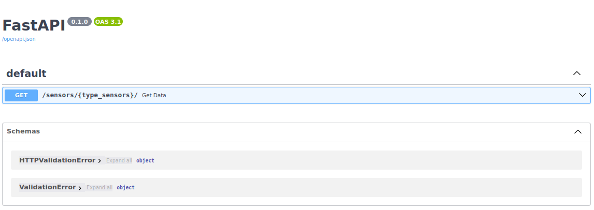
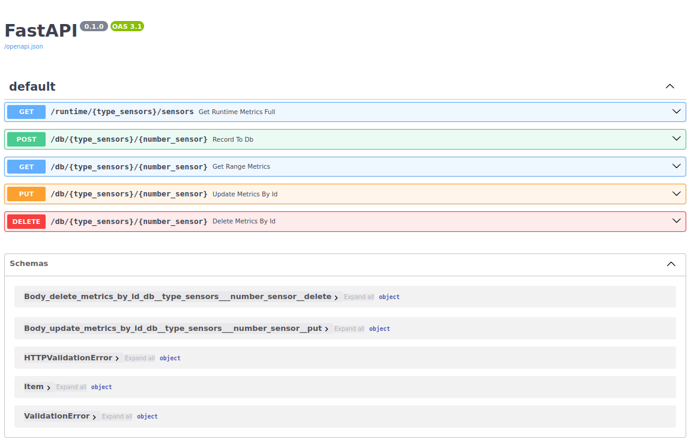

## GreenTech

## Краткое описание

## Структура проекта

```
├── generator
│   ├── Dockerfile
│   ├── generators.py
│   ├── logger.log
│   ├── main.py
│   ├── requirements.txt
│   └── schemes.py
├── management
│   ├── dependencies.py
│   ├── Dockerfile
│   ├── filler.py
│   ├── main.py
│   ├── models.py
│   ├── requirements.txt
│   └── schemas.py
├── docker-compose.yml
├── .env
```

## Запуск

```
$ git clone https://github.com/glebserg/data-flow.github .
$ docker-compose up
```

## API Generator

http://localhost:5001/docs - ссылка на документацию


## API Management

http://localhost:5002/docs - ссылка на документацию


## БД

```
Таблица "sensors":
------------------------
| id | type_sensor | number |
------------------------
|    |             |        |

Таблица "metrics_temperature":
------------------------------
| id | sensor_id |     created     | value |
------------------------------
|    |           |                 |       |

Таблица "metrics_humidity":
----------------------------
| id | sensor_id |     created     | value |
----------------------------
|    |           |                 |       |

Таблица "metrics_carbon_dioxide":
---------------------------------
| id | sensor_id |     created     | value |
---------------------------------
|    |           |                 |       |
```

Описание таблиц:

1. Таблица "sensors" содержит информацию о сенсорах.
    - Поле "id" - уникальный идентификатор сенсора.
    - Поле "typesensor" - тип сенсора (строка, максимальная длина 20 символов).
    - Поле "number" - номер сенсора (целое число).

2. Таблица "metricstemperature" содержит метрики температур.
    - Поле "id" - уникальный идентификатор метрики.
    - Поле "sensorid" - идентификатор сенсора, к которому относится метрика (внешний ключ, связь с таблицей "sensors").
    - Поле "created" - дата и время создания метрики (с индексом для ускорения поиска).
    - Поле "value" - значение температуры (число с плавающей точкой).

3. Таблица "metricshumidity" содержит метрики влажности.
    - Поле "id" - уникальный идентификатор метрики.
    - Поле "sensorid" - идентификатор сенсора, к которому относится метрика (внешний ключ, связь с таблицей "sensors").
    - Поле "created" - дата и время создания метрики (с индексом для ускорения поиска).
    - Поле "value" - значение влажности (число с плавающей точкой).

4. Таблица "metricscarbondioxide" содержит метрики уровня CO2 (углекислого газа).
    - Поле "id" - уникальный идентификатор метрики.
    - Поле "sensorid" - идентификатор сенсора, к которому относится метрика (внешний ключ, связь с таблицей "sensors").
    - Поле "created" - дата и время создания метрики (с индексом для ускорения поиска).
    - Поле "value" - значение уровня CO2 (целое число)