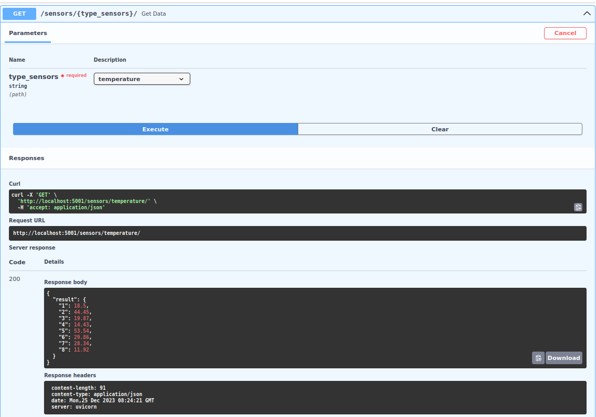

## GreenTech

## Краткое описание


## Структура проекта

```
├── generator
│   ├── Dockerfile
│   ├── generators.py
│   ├── logger.log
│   ├── main.py
│   ├── requirements.txt
│   └── schemes.py
├── management
│   ├── dependencies.py
│   ├── Dockerfile
│   ├── filler.py
│   ├── main.py
│   ├── models.py
│   ├── requirements.txt
│   └── schemas.py
├── docker-compose.yml
├── .env
```

## Запуск


```
$ git clone https://github.com/glebserg/data-flow.github .
$ docker-compose up
```

## API Generator
http://localhost:5001/docs - ссылка на документацию


[//]: # (![Alt text]&#40;api_generator_sensors.png&#41;)
<kbd>
  
</kbd>


## API Management
http://localhost:5002/docs - ссылка на документацию

